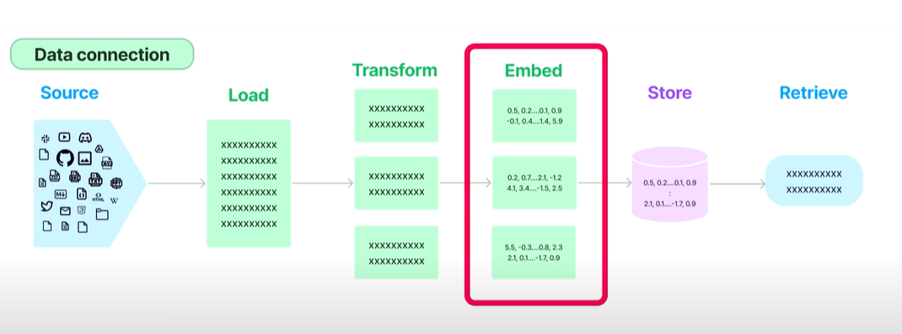

# GenAI

## 20-80% Terms of GentAI you should know.

`Neural Networks`: Fundamental to GenAI, these are computational models inspired by the human brain, used to recognize patterns and solve complex problems.
They are the backbone of most GenAI applications.

`Transformer Models`: Advanced deep learning models used in NLP. 
They have revolutionized GenAI with their ability to handle sequential data, like text, more effectively than previous models.

`Generative Adversarial Networks (GANs)`: These are used for generating new data instances that resemble your training data, popular in image generation and modification.

`Transfer Learning`: Leveraging a pre-trained model on a new, related task. It's efficient for GenAI as it reduces the need for large datasets and extensive training.

`Attention Mechanisms`: A component of neural networks that helps models focus on specific parts of the input, crucial for tasks that require context understanding in GenAI.

`Language Models`: These are specialized models in NLP that can generate, understand, or translate human language.
Examples include GPT (Generative Pre-trained Transformer) and BERT (Bidirectional Encoder Representations from Transformers).

`Autoencoders`: Used for unsupervised learning tasks in GenAI, they help in data denoising and dimensionality reduction.

`Sequence-to-Sequence Models`: Used in GenAI for tasks that involve converting one sequence to another, like translation or summarization.

`Ethics and Bias in AI`: Understanding the ethical implications and potential biases in AI models is crucial for responsible development and deployment in GenAI.

`Data Augmentation`: A technique to increase the diversity of your training data without collecting new data, vital for improving model robustness in GenAI.

`Model Interpretability and Explainability`: The ability to understand and explain how AI models make decisions, increasingly important in GenAI for trust and transparency.

`Federated Learning`: A technique for training algorithms across multiple decentralized devices or servers holding local data samples, maintaining privacy and efficiency in GenAI.

`Adversarial Attacks and Defense`: Understanding the vulnerabilities of AI models to malicious inputs and developing strategies to defend against such attacks.

`Scalability in AI`: Strategies for scaling AI models and infrastructure to handle large datasets and complex tasks in GenAI.

`AI Governance and Regulation`: Knowledge of the legal and regulatory landscape surrounding AI, essential for compliant and ethical GenAI applications.

`RAG`:
RAG, or Retrieval-Augmented Generation, in the context of Generative AI, is a technique that enhances language models by combining them with external information retrieval systems.
This approach allows the model to pull in relevant external knowledge to improve the quality and accuracy of its responses.

`Fine-Tuning`: The process of adjusting a pre-trained model on a specific dataset or for a specific task.
It's a common practice in GenAI to achieve high performance without extensive training.

`Embeddings`: Embeddings are numerical representations of text, words, or other types of data in a high-dimensional space, where the positioning and distance between points capture semantic or contextual relationships. 
They enable machine learning models to process and analyze complex data (like text) by converting it into a format that algorithms can understand and work with efficiently.

**What is the difference between RAG and Fine-Tuning ?**

Fine-Tuning involves adjusting a pre-trained model on a new, specific dataset or task, enhancing its performance in that particular context.
It's a method to tailor a general-purpose model to specialized requirements.

In contrast, RAG integrates a pre-trained model with an external information retrieval system, enabling the model to dynamically access and utilize external knowledge,
particularly useful in applications like smart assistants where real-time information integration is crucial for accurate and contextually relevant responses.

